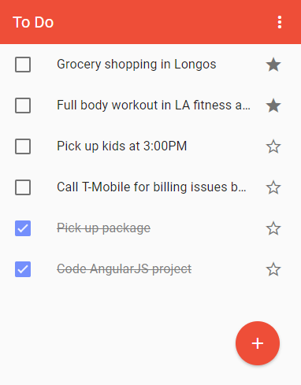

<h1 align="center">
  
   
  Todo App - AngularJS + Material-UI
</h1>

This todo sample web single page application utilize the following technolog

- AngularJS 
- Material-UI
- UI-Router**

[DEMO](http://demo.platformular.com/angularJStodoapp/)

## Get started

The angularJS project was coded using CDN way so that developers can get the project setup in no time.

1. Download or clone the repository 
2. launch repository in Visual Studio Code (Recommended)
3. Install Live Server Extension
4. Right click the index.html and click on "Open with live server"

